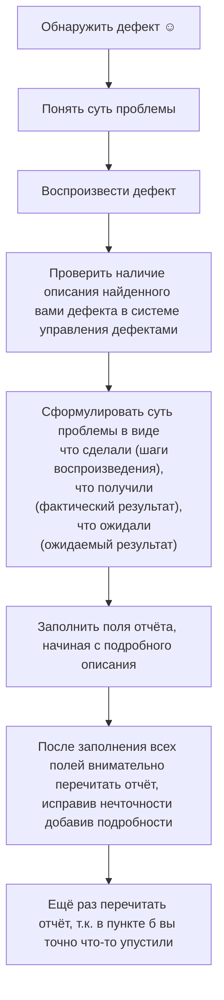

# Лекция от 30 апреля 2024

## Свойства качественных отчётов о дефектах

- тщательное заполнение полей точной и корректной информацией
- правильный технический язык
- специфичность описания шагов
  
| недостаточно специфичные шаги                                                                                                                                                     | достаточно специфичные шаги                                                                                                                                                                         |
| --------------------------------------------------------------------------------------------------------------------------------------------------------------------------------- | --------------------------------------------------------------------------------------------------------------------------------------------------------------------------------------------------- |
| 1. отправить на конвертацию файл допустимого формата и размера, в котором русский текст представлен в разных кодировках  дефект: конвертация кодировок производится неверно | 1. отправить на конвертацию файл в формате HTML размером от 100 КБ до 1 МБ, в котором русский текст представлен в кодировках UTF-8 (10 строк по 100 символов) и WIN-1251 (20 строк по 100 символов) |

- отсутствие лишних действий и/или их длинных описаний

| плохо                                                                                                                                                                                               | хорошо                                                                                                                                                                 |
| --------------------------------------------------------------------------------------------------------------------------------------------------------------------------------------------------- | ---------------------------------------------------------------------------------------------------------------------------------------------------------------------- |
| 1. запустить приложение со всеми верными параметрами 2. подождать более 30 минут 3. передать на конвертацию файл допустимого формата и размера  дефект: приложение не обрабатывает файл | предусловие: приложение запущено и проработало более 30 минут передать на конвертацию файл допустимого формата и размера дефект: приложение не обрабатывает файл |

- отсутствие дубликатов
    - производить поиск
    - максимально информативные краткие описания
    - в подробном описании дефекта указывать сообщения от приложения
    - участие в митингах по прояснению
    - если есть дополнительная информация, внесите её в существующий отчёт о дефекте не создавая новый
- очевидность и понятность: писать так, чтобы не возникло мысли, что это не дефект
- прослеживаемость: понятно, какую функцию, какое требование затрагивает дефект
- отдельные отчёты для каждого нового дефекта
    существует два незыблемых правила:
    - в каждом отчёте описывается ровно один дефект
    - при обнаружении нового дефекта создаётся новый отчёт. нельзя для описания нового дефекта править старые отчёты, переводя их в состояние "открыт заново"
- соответствие принятым шаблонам оформления и традициям

## Логика создания эффективных отчётов о дефектах

