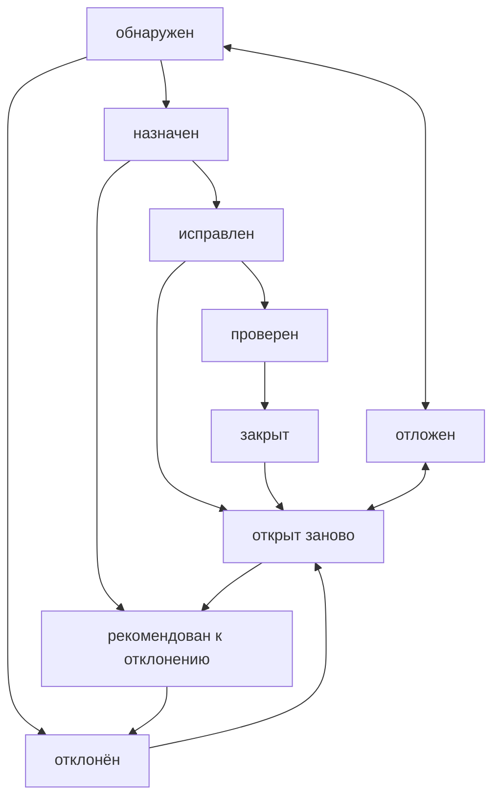

# Лекция от 29 апреля 2024

## Отчёты о дефектах

### Определения

**Дефект** - расхождение ожидаемого и фактического результата

**ISTQB** (International Software Testing Qualifications Board) - некоммерческая организация, зарегистрированная в Бельгии, миссией которой является нести свет процесса тестирования в массы на основе лучших международных практик.

**Ошибка** - действие человека, приводящее к некорректным результатам.
**Дефект** - недостаток в компоненте или системе, способный привести к ситуации сбоя или отказа.
**Сбой** (interruption) или **Отказ** (failure) - отклонение поведения системы от ожидаемого.

По ГОСТу:
**Сбой** - это самоустраняющийся отказ или однократный отказ, устраняемый незначительным вмешательством оператора.
**Отказ** - это событие, заключающееся в нарушении работоспособного состояния.

**Аномалия** или **Инцидент** - это любое отклонение наблюдаемого (фактического) состояния, поведения, значения, результата, свойства от ожиданий наблюдателя, сформированных на основе требований, спецификаций, иной документации или опыта и здравого смысла.

**Дефект** - отклонение фактического результата от ожиданий наблюдателя, сформированных на основе требований, спецификаций, иной документации или опыта и здравого смысла.

**Отчёт о дефекте** - документ, описывающий и приоритизирующий обнаруженный дефект, а также содействующий его устранению.
Как следует из самого определения, отчёт о дефекте пишется со следующими основными целями:

- предоставить информацию о проблеме
- приоритизировать проблему
- содействовать устранению проблемы

### Атрибуты отчёта о дефекте

1. **Идентификатор** - уникальное значение, позволяющее однозначно отличить один отчёт о дефекте от другого и используемое во всевозможных ссылках.
2. **Краткое описание** должно в предельно лаконичной форме давать исчерпывающий ответ на вопросы: что произошло, где произошло и при каких обстоятельствах это произошло.
    Алгоритм краткого описания дефектов:
    1. полноценно понять суть проблемы
    2. сформулировать подробное описание дефекта
    3. убрать из подробного описания всё лишнее
    4. выделить в подробном описании ответы на вопросы
    5. оформить пункт 4 в виде законченного, грамматически правильного, предложения
    6. если предложение получилось слишком длинным, переформулировать его, сократив длину, засчёт подбора синонимов, использования общепринятых форм и сокращений.
3. **Подробное описание** предоставляет в развёрнутом виде необходимую информацию о дефекте, а также обязательно описание фактического результата, ожидаемого результата и ссылку на требование.
4. **Алгоритм воспроизведения** описывает действия, которые необходимо выполнить для воспроизведения.
5. **Воспроизводимость** показывает при каждом ли прохождении по шагам удаётся вызвать его проявление. Всегда 2 значения: всегда и иногда.
6. **Важность** показывает степень ущерба, который наносится проекту, существованием дефекта.
    Выделяют следующие градации важности:
    1. низкое
    2. среднее
    3. высокое
    4. критическое
7. **Срочность** показывает как быстро дефект должен быть устранён.
    Градации:
    1. низкое
    2. обычное
    3. высокое
    4. наивысшее
8. **Симптом** позволяет классифицировать дефекты по их типичному проявлению.
    - косметический
    - повреждение или потеря данных
    - проблема в документации
    - некорректная операция
    - проблема инсталляции
    - ошибки локализации
    - нереализованная функциональность
    - проблема масштабируемости
    - низкая производительность
    - крах системы
    - неожиданное поведение
    - расхождение с требованием
    - предложение по улучшению
9. **Возможность обойти** показывает существует ли альтернативная последовательность действий, выполнение которой позволило бы пользователю достичь поставленной цели.
10. **Комментарий** может содержать любые полезные для понимания и исправления дефекта данные
11. **Приложения** представляет собой список прикреплённых к отчёту о дефекте приложений
