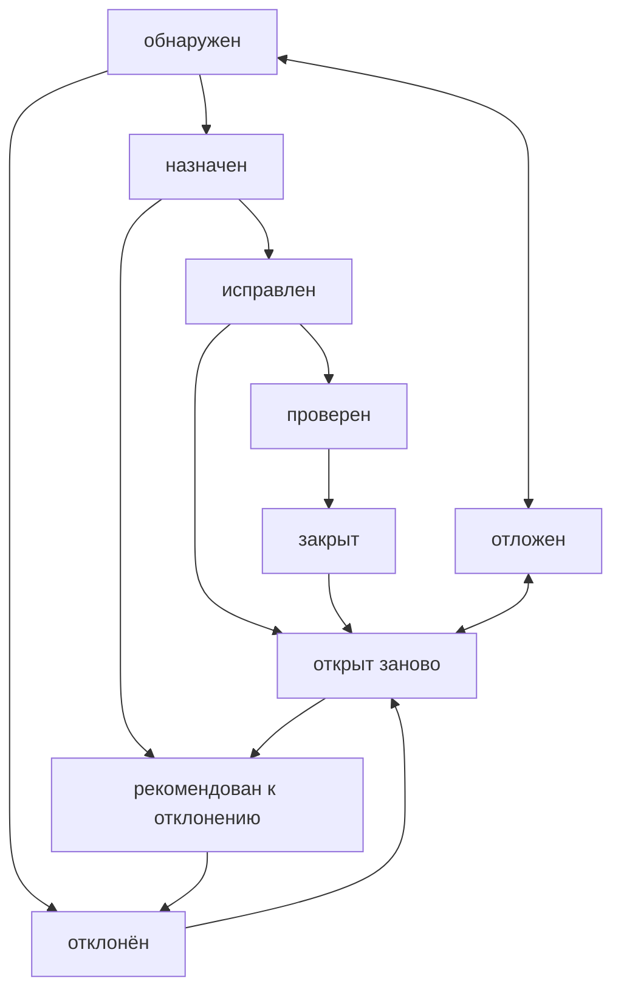
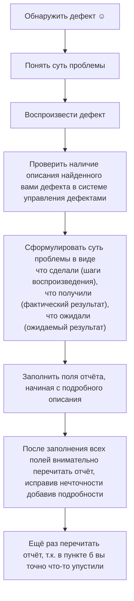

# Лекция 19 февраля 2024

---

**Тестирование программного обеспечения** - процесс анализа программного средства и сопутствующей документации с целью выявления дефектов и повышения качества продуктов.

## Эпохи тестирования

- 1950-1960: Процесс тестирования был предельно формализован, отделён от процесса непосредственной разработки ПО. В 60 годах появилась концепция исчерпывающего тестирования. это проверка всех возможных путей выполнения кода со всевозможными входными данными.
- 1970: Зародились 2 фундаментальные идеи тестирования:
    1. Positive testing - процесс доказательства работоспособности ПО в некоторых заданных условиях.
    2. Negative testing - процесс доказательства неработоспособности ПО в некоторых заданных условиях.
- 1980: произошло ключевое изменение места тестирования в разработке ПО. Вместо одной из финальных стадий создания проекта, тестирование стало применятся на протяжении всего цикла разработки (Software lifecycle).
- 1990: произошёл переход от тестирования как такового, к более всеобъемлющему процессу... . он охватывает весь цикл разработки ПО и затрагивает процесс планирования, проектирования, создания и выполнения тест кейсов, поддержка имеющихся тест кейсов и тестовых окружений.
- 2000: В контексте поиска новых путей методологии и появление гибких методологий разработки и таких подходов как "Разработка под управлением тестирования" (TDD - Test Driving Development).

## Нужные навыки тестировщика

Главная цель тестировщика - понимать что в настоящий момент необходимо проекту, получает ли проект это необходимое в должной мере, и если нет, то как изменить ситуацию к лучшему.

- Владение компьютером
- Иностранные языки
- Программирование
- База данных и язык SQL
- Понимание принципов работы сетей и ОС
- Понимание принципов работы веб-приложений и мобильных приложений

## Процессы тестирования и разработки ПО

### Модели разработки ПО

**Модель разработки ПО** (Software Development Model - SDM) - структура, систематизирующая различные виды проектной деятельности, их взаимодействие и последовательность в процессе разработки ПО. Выбор той или иной модели зависит от масштаба и сложности проекта, предметной области, доступных ресурсов и множества других факторов.
Классические модели разработки ПО:

1. **Водопадная**
    Представляет скорее исторические интересы, в современных проектах практически не применимы. Она предполагает однократное выполнение каждой из фаз проекта, который в свою очередь строго следует друг за другом.
    - Особенности
        - высокий уровень формализации процессов
        - большое количество документации
        - жёсткая последовательность этапов жизненного цикла без возможности возврата на предыдущий этап
    - Плюсы
        - высокая прозрачность разработки и фаз проекта
        - чёткая последовательность
        - стабильность к требованиям
    - Минусы
        - проект должен постоянно иметь актуальную документацию (избыточность)
        - у заказчика нету возможности ознакомится с пилотным выпуском
        - все требования должны быть известны в начале проекта
2. **V-образная**
    Является логическим развитием водопадной. В общем случае может содержать один и тот же набор стадий, но принципиальное отличие заключается в том, как эта информация используется в процессе реализации проекта. Суть модели состоит в том, что процессы на всех этапах контролируются, чтобы убедится в возможности перехода на следующий уровень.
    - Плюсы
        - строгая этапизация
        - минимизация рисков
        - усовершенствованный тайм-менеджмент
    - Минусы
        - невозможность адаптироваться к изменённым требованиям заказчика
        - увеличенное время разработки
3. **Итерационная инкрементальная**
    Свойственна определённая двойственность.
    С точки зрения жизненного цикла, модель является итерационной (подразумевает многократное повторение одних и тех же стадий).
    С точки зрения развития продукта (приращения их полезных функций), модель является инкрементальной.
    Ключевой особенностью данной модели является разбиение проекта на относительно небольшие промежутки (итерации), каждый из которых может включать в себя все Классические стадии присущие водопадной и V-образной модели.
    Результатом итерации является приращение (инкремент) функциональности продукта, выраженное в промежуточном билде.
4. **Спиральная**
    Представляет собой частный случай итерационно-инкрементальной модели, в котором особое внимание уделяется управлению рисками, в особенности влияющие процессы разработки проекта и контрольные точки.
5. **Гибкая** (Agile): представляет собой совокупность различных подходов к разработке и базируется на так называемом Agile манифесте:
    - люди и взаимодействие важнее инструментов
    - работающий продукт важнее исчерпывающей документации
    - сотрудничество с заказчиком важнее согласования условий контракта
    - готовность к изменениям важнее следования первоначальному плану

    Она включает серии подходов к разработке ПО, ориентированных на использование итеративной разработки. Динамическое формирование требований и обеспечение их реализации в результате постоянного взаимодействия внутри рабочих групп. Отдельные итерации представляют собой миниатюрный программный проект.

    - Плюсы
        - быстрое принятие решений
        - минимизация рисков
        - облегчённая работа с документацией
    - Минусы
        - большое количество митингов
        - сложно планировать процессы
        - редко используется для больших проектирования
6. Scram: особенность в разделении обязанностей, т.е. должности

### Жизненный цикл тестирования

1. Общее планирование и анализ требований
    Даёт ответы на такие вопросы:
    - что нам предстоит тестировать
    - как много будет работы
    - какие есть сложности
    - всё ли необходимое у нас есть
2. Уточнение критериев приёмки
    Позволяет сформулировать или уточнить метрики и признаки возможности или необходимости начала тестирования при остановке или возобновлении тестирования, завершения или прекращения тестирования.
3. Уточнение стратегии тестирования
    Рассматриваются и уточняются те части стратегии тестирования, которые актуальны для текущей итерации.
4. Разработка тест-кейсов
    Посвящена разработке, пересмотру, уточнению, доработке, переработке и прочим действиям с тест-кейсами, на уровне тест-кейсов, и иными артефактами, которые будут использоваться при тестировании.
5. Выполнение тест-кейсов и 6. Фиксация найденных дефектов
    Эти стадии тесно связаны между собой и выполняются одновременно. Дефекты фиксируются сразу по факту их обнаружения в процессе выполнения тест-кейсов.
6. Анализ результатов тестирования и 8. Отчётность
    Связаны и выполняются параллельно. Формулируемые на стадии анализа результатов выводы напрямую зависят от плана тестирования. Критериев к приёмке ...(?) и уточнённых стратегиях, полученных на стадиях 1, 2, 3. Полученные выводы оформляются на стадии 8, и служат основой для стадии 1, 2, 3 следующей итерации тестирования. Таким образом цикл замыкается.
# Лекция 21 февраля 2024

---

**Требование** - описание того, какие функции и с соблюдением каких условий должно выполнять приложение в процессе решения полезной для пользователя задачи.

## Важность требований

Описывая важность требований, подчёркивается, что они:

- Позволяют понять, что и с соблюдением каких условий система должна делать
- Предоставляют возможность оценить масштаб изменений и управлять изменениями
- Являются основой для формирования плана проекта (в том числе плана тестирования)
- Помогают предотвращать или разрешать конфликтные ситуации
- Упрощают расстановку приоритетов в наборе задач
- Позволяют объективно оценить степень прогресса в разработке проекта

## Виды документации

Документацию можно разделить на два больших вида в зависимости от **времени** и **места** её использования.

1. **Продуктная документация** используется проектной командой во время разработки и поддержки продукта. Она включает:
    - **План проекта** и в том числе тестовый план
    - **Требования к программному продукту** и функциональные спецификации
    - **Архитектуру и дизайн**
    - **Тест-кейсы и наборы тест-кейсов**
    - **Технические спецификации**, такие как схемы баз данных, описания алгоритмов, интерфейсов и т.д.
2. **Проектная документация** включает в себя как продуктную документацию, так и некоторые дополнительные виды документации и используется не только на стадии разработки, но и на более ранних и поздних стадиях (например, на стадии внедрения и эксплуатации).
    - **Пользовательскую и сопроводительную документацию**, такую как встроенную помощь, руководство по установке и использованию, лицензионные соглашения и т.д.
    - **Маркетинговую документацию**, которую представили ...

## Классификация требований

- **Прямые** (явно указаны и прописаны)
- **Косвенные** (не указаны и не прописаны, но так должно быть)

- **Функциональные**
    - Бизнес требования
    - Требования пользователей
    - Функциональные требования
- **Нефункциональные**

## Источники требований

1. Заказчик
2. Мозговой штурм
3. Документы
4. Фокус группа
5. Наблюдение
6. Моделирование
7. Анкетирование
8. Прототип
9. Описание
10. Нормы
11. Лучшие практики
12. Конкуренты

## Характеристики требований

1. Завершённость
2. Непротиворечивость
3. Корректность
4. Недвусмысленность
5. Проверяемость
6. Атомарность
7. Выполнимость
8. Обязательность

## Типичные ошибки при анализе и тестировании требований

1. Отметка того факта, что с требованием всё в порядке
2. Задавание плохо сформулированных вопросов
3. Категоричные заявления без обоснования
4. Указание проблемы с требованиями без пояснения её сути
5. Плохое оформление вопросов и комментариев
6. Описание проблемы не в том месте, к которому она относится
7. Ошибочное восприятие требования как "требования к пользователю"
8. Скрытое редактирование требований
9. Анализ, не соответствующий уровню требований
# Лекция 11 марта 2024

## Типичные ошибки при анализе тестирования требований

### Анализ, не соответствующий уровню требований

#### Виды и направления тестирования

#### Виды тестирования

- Статическое тестирование - тестирование без запуска кода на исполнение
- Динамическое тестирование - с запуском кода на исполнение

#### По степени автоматизации

- Ручное
- Полуавтоматизированное
- Автоматизированное: набор техник, подходов и инструментальных средств, позволяющих исключить человека из выполнения некоторых задач в процессе тестирования

#### По объектам

- Функциональные - вид тестирования, направленный на проверку корректности работы функциональности системы (корректность реализации функциональных требований)
    - GUI
    - Безопасность

- Нефункциональные - вид тестирования, направленный на проверку нефункциональных особенностей приложения (корректность реализации нефункциональных требований)
    - Безопасность - тестирование, направленное на проверку способности приложения противостоять злонамеренным попыткам получения доступа к данным или функциям, права на доступ к которым у злоумышленника нету
    - UI - тестирование, направленное на проверку интерфейса приложения или его компонентов
        - Соответствие дизайну
        - Внешний вид и профессиональные выполнения
        - Соблюдение единого стиля
    - Удобство использования
        - Как быстро пользователь достигает цели
        - Как долго вспоминать то, чему научился
        - Размер кнопок
        - Часто ли пользователю нужно выбирать
        - Большие ли списки
        - Порог вхождения
    - Локализация - тестирование, направленное на проверку корректности и качества адаптаций продукта к использованию на том или ином языке с учётом национальных и культурных особенностей
        - Текст
        - Функционал (форматы даты, времени валюты и т.д.)
        - Региональные особенности
        - Контент (цензура)
    - Интернациональное - тестирования, направленное на проверку готовности продукта к работе с использованием различных языков и с учётом различных национальных и культурных особенностей
    - Конфигурационное (способность приложения работать в указанном окружении)
    - Совместимости
    - Инсталляционное - тестирование, направленное на выявление дефектов влияющих на протекание стадии инсталляции
        - Установка
        - Удаление
        - Обновление
    - Производительности
        - Нагрузочное
        - Стрессовое
        - Стабильности
        - Масштабируемости
        - Объёмами
        - Конкурентами (исследование поведения системы в ситуации конкуренции между запросами за ресурс)
    - Тестирование на отказ и восстановление (помехоустойчивость) - тестирование, заключающееся в эмуляции или реальном создании критических ситуаций с целью проверки способности приложения задействовать соответствующие механизмы, предотвращающие нарушение работоспособности, производительности и повреждения данных
    - Тестирование документации
# Лекция от 15 марта 2024

#### Виды тестирования по объектам

- Связанные с изменениями
   - **Дымовое** (smoke test, intake test, build verification test). Направлено на проверку самой главной, самой важной, ключевой функциональности, неработоспособность которой делает бессмысленной саму идею использования приложения (или иного объекта, подвергаемого дымовому тестированию).
   - **Регрессионное** (regression testing). Направлено на проверку того факта, что в ранее работоспособной функциональности не появились ошибки, вызванные изменениями в приложении или среде его функционирования.
   - **Тестирование сборки** (build verification test). Направлено на определение соответствия выпущенной версии критериям качества для начала тестирования. По своим целям является аналогом дымового тестирования, направленного на приёмку новой версии в дальнейшее тестирование и эксплуатацию.
   - **Санитарное** (sanity testing). Относится к виду тестирования, которое используется с целью доказательства работоспособности конкретной функции или модуля согласно заявленным техническим требованиям.
   - Повторное (re-testing, confirmation testing). Выполнение тест-кейсов, которые ранее обнаружили дефекты, с целью подтверждения устранения дефектов. Фактически этот вид тестирования сводится к действиям на финальной стадии жизненного цикла отчёта о дефекте, направленным на то, чтобы перевести дефект в состояние "проверен" и "закрыт".

#### Уровни тестирования

- Модульное (unit testing, module testing, component testing). Направлено на проверку отдельных небольших частей приложения, которые (как правило) можно исследовать изолированно от других подобных частей.
- Интеграционное (integration testing). Направлено на проверку взаимодействия между несколькими частями приложения (каждая из которых, в свою очередь, проверена отдельно на стадии модульного тестирования).
- Системное (system testing). Направлено на проверку всего приложения как единого целого, собранного из частей, проверенных на двух предыдущих стадиях.
- Приёмное (acceptance testing). Формализованное тестирование, направленное на проверку приложения с точки зрения конечного пользователя/заказчика и вынесения решения о том, принимает ли заказчик работу у исполнителя (проектной команды).

#### Методы тестирования

Метод тестирования даёт понять насколько глубоко вы можете погрузиться в техническую составляющую вашего продукта.

- Чёрный ящик (black box testing) - метод тестирования, в рамках которого у тестировщика либо нет доступа к внутренней структуре и коду приложения, либо недостаточно знаний для их понимания, либо он сознательно не обращается к этим данным в процессе тестирования.
- Серый ящик (gray box testing) - комбинация методов белого и чёрного ящиков, состоящая в том, что к части кода и архитектуры у тестировщика доступ есть, а к части - нет. Компания ISTQB (International Software Testing Qualifications Board) занимается сертифицированием тестировщиков.
- Белый ящик (white box testing) - метод тестирования, в рамках которого у тестировщика есть доступ к внутренней структуре и коду приложения, а также есть достаточно знаний для понимания увиденного.

#### Направления тестирования

- Статическое тестирование (static testing) - тестирования без запуска кода на исполнение.
    - Документы
    - Графические прототипы
    - Код приложения
    - Параметры (настройки) среды исполнения приложения
    - Подготовленные тестовые данные
- Динамическое тестирование (dynamic testing) - тестирование с запуском кода на исполнение. Запускаться на исполнение может как код всего приложения целиком (системное тестирование), так и код нескольких взаимосвязанных частей (модульное или компонентное тестирование) и даже отдельные участки кода.

#### Тестирование по степени удалённости

- Альфа-тестирование (alpha testing). Выполняется внутри организации-разработчика с возможным частичным привлечением конечных пользователей. Может являться формой внутреннего приёмочного тестирования. Продукт уже можно периодически показывать внешним пользователям, но он ещё достаточно "сырой", потому основное тестирование выполняется организацией-разработчиком.
- Бета-тестирование (beta testing). Выполняется вне организации-разработчика с активным привлечением конечных пользователей/заказчиков. Может являться формой внешнего приёмочного тестирования. Продукт уже можно открыто показывать внешним пользователям, он уже достаточно стабилен, но проблемы всё ещё могут быть, и для их выявления нужна обратная связь от реальных пользователей.
    - Открытый - даётся доступ всем, кто захочет.
    - Закрытый - даётся какой-то конкретной группе лиц.
- Гамма-тестирование (gamma testing) - Финальная стадия тестирования перед выпуском продукта. Иногда в гамма-тестировании...

#### Тестирование по ожидаемому поведению

- Позитивное тестирование (positive testing). Направлено на исследование приложения в ситуации, когда все действия выполняются строго по инструкции без каких бы то ни было ошибок, отклонений, ввода неверных данных и т.д.
- Негативное тестирование (negative testing, invalid testing). Направлено на исследование работы приложения в ситуациях, когда с ним выполняются (некорректные) операции и/или используются данные, потенциально приводящие к ошибкам (классика жанра - деление на ноль).
# Лекция от 8 апреличка 2024

Чек-лист - набор идей (по тестированию, по разработки, по планированию и управлению)

Свойства чек-листа:
 * Логичность.
   Чек-лист пишется не просто так, а на основе целей и для того, чтобы помочь в достижении этих целей.
 * Последовательность и структурированность.
   Последовательность достигается за счёт оформления чек-листа в виде многоуровневого списка.
   Последовательность - цепочка действий (формирование небольших групп идей и переходы между ними)
 * Полнота и неизбыточность.
   Чек-лист должен представлять из себя "сухую выжимку" идей, в которых нет дублирования и в то же время не что важное не упущено.

#### Из чего состоит чек-лист:

Атрибуты:
   * Номер - уникальное значение идентификатора.
   * Описание проверки - кратко и ёмко суть проверки.
   * Статус - текущее состояние проверки.
   * Комментарий - просто комментарий с дополнительной информацией, которую не  получилось никуда вписать.

Статусы:
 1. Passed: багов не найдено.
 2. Failed: найдено один или больше багов.
 3. Skipped: пункт проверяться не будет по какой-либо причине. Хочу домой.
 4. No run: ещё не проверено.
 5. Blocked: невозможно проверить потому, что один из багов блокирует.
 6. In progress: в процессе работы.
 7. Closed: закрыт, но не пройден и не провален. Deprecated.

#### Как составить чек-лист

Принципы составления чек-листа:
* Один пункт = одна проверка.
* При составлении чек-листа нужно опираться на требования для того, чтобы не тестировать то, что несущественно.
* Давайте пунктам чек-листа названия по форме, общей для всех членов команды.
* Детализировать в зависимости от задачи.
* Объединяйте чек-листы в матрицы.
  Строчки - тесты. Столбики - клиенты, например различные браузеры.

#### Плюсы и минусы чек-листов

Плюсы:
* Гибкость.
* Простота создания и поддержки.
* Простота визуализации.
* Расширение тестового покрытия.
* Каждый выполняет по-своему.

Минусы:
* Каждый выполняет по-своему.
* Невыполнимость тестовых данных.
* Неэффективен для джунов.
* Высокая вероятность разночтения.

#### Тест-кейсы это что ваще

Тест - это набор из одного или нескольких тест-кейсов. А ещё это набор данных условий выполнения бла, бла, бла

Тест-кейс - набор входных данных, условий выполнения и ожидаемых результатов, разработанный с цель проверки того или иного свойства или поведения программного средства.

#### Из чего сделан тест-кейс

Состав:
* Номер кейса (id) - уникальное значение, позволяющее однозначно отличить один тест-кейс от другого и используемое во всевозможных ссылках.
* Заголовок - штука, которая признана упростить и ускорить понимание основной цели тест-кейса без обращения к его остальным атрибутам.
* Предусловия - исходные данные, необходимые для выполнения тест-кейса. Позволяют описать всё то, что было подготовлено до начала выполнения. То, что описывается в этом поле, готовится без использования тестируемого приложения.
* Шаги проверки - описывают последовательность действий, которые необходимо реализовать в процессе выполнения.
  Рекомендации по написанию правильных шагов:
  1. Начать с понятного и привычного действия.
  2. Даже если в тест-кейсе всего один шаг, то всё равно нумеруйте его.
  3. На русском языке используйте безличную форму. На английском не надо использовать частичку to.
  4. Пишите шаги последовательно. Без условных конструкций.
  5. Ссылайтесь на предыдущие шаги.
* Ожидаемый результат - описывает реакцию приложения на действия, описанные в поле "шаги проверки".
  Рекомендации:
  1. Описывайте поведения системы без субъективного толкования.
  2. Пишете ожидаемый результат без исключения.
  3. Пишите кратко, но информативно.
  4. Избегайте условных конструкций.
  5. В ожидаемом результате всегда должно описываться только корректная работа приложения.

Опциональные штуки:
* Модуль - указывает на части приложения, к которым относится тест-кейс и позволяет лучше понять его цель.
* Приоритет - показывает важность тест-кейсов. Может быть буквами(A,B,C), цифрами(1,2,3), словами. Приоритет может коррелировать со следующими штуками:
  * Важность требований.
  * Степени риска.
* Связанное требование - показывает то основное требование, проверки выполнения которого посвящён тест-кейс.

Статусы тест-кейса.
* Passed - Дефектов обнаружено не было. Ожидаемый результат совпадает с фактическим.
* Failed - Ожидаемый результат не совпадает с фактическим.
* Skipped - Тест-кейс пропущен по какой-либо причине.
* No run / No test - Ещё не был запущен.
* Blocked - Выполнение невозможно по причине каких-либо дефектов.

Дополнительные статусы тест-кейса.
* New - Только после создания.
* Planned - запланирован, включён в план ближайшей итерации тестирования.
* In progress - выполняется и займёт ещё длительный период времени на выполнение.
* Closed - закрыт. Переводят чтобы подчеркнуть тот факт, что на данной итерации все действия с этим тест-кейсом завершены.
* Not ready - состояние и из него тест-кейс может быть переведён в любой момент времени. Возможно значит, что требуется доработка.

Правила:
1. Независимость.
2. Однозначность.
3. Полнота.
4. Обезличивание.
5. Упрощение.
6. Один тест - одна цель.

#### Виды тест-кейсов

##### Высокоуровневый тест-кейс
Без конкретных входных данных и ожидаемых результатов.
Более абстрактный.

##### Низкоуровневый тест-кейс
С конкретными входными данными и ожидаемыми результатами.
Классический вид тестирования. Полностью готовый к выполнению тест-кейс.
# Лекция от 22 апреля 2024

## Терминология и общие положения

**Набор тест-кейсов** - совокупность тест-кейсов, выбранных с некоторой общей целью или по некоторому общему признаку. Иногда в такой совокупности результаты завершения одного тест-кейса становится входным состоянием приложения для следующего тест-кейса.

Наборы тест-кейсов:

- **свободные** (порядок выполнения тест-кейсов не важен)
    - можно выполнять в любом удобном порядке, а также создавать наборы внутри наборов
    - если какой-то тест-кейс завершился ошибкой, это не повлияет на возможность выполнения других тест-кейсов
- **последовательные** (порядок выполнения тест-кейсов важен)
    - каждый следующий в наборе тест-кейс в качестве входного состояния получает результат работы предыдущего тест-кейса, что позволяет сильно сократить количество шагов в отдельных тест-кейсах.
    - длинные последовательные действия куда лучше имитируют работу реальных пользователей

### Пользовательские сценарии

Это цепочки действий, выполняемых пользователем в определённой ситуации для достижения определённой цели.

Преимущества:

- сценарии показывают реальные действия пользователя
- сценарий понятен конечному пользователю и хорошо подходит для обсуждения и совместного улучшения
- сценарии и их части легче оценивать с точки зрения важности, чем отдельные пункты требований
- сценарии отлично показывают недоработки в требованиях
- В предельном случае (нехватка времени и прочие форс-мажоры) сценарии можно даже не прописывать подробно, а просто именовать - и само наименование уже подскажет опытному специалисту, что делать.

### Принципы построения

- на основе чек-листов
- на основе разбиения приложения на модули и подмодули
- по принципу проверки самых важных, менее важных и всех остальных функций приложения
- по принципу группировки тест-кейсов
- по принципу частоты обнаружения тест-кейсами дефектов в приложении
- по архитектурному принципу
- по области внутренней работы приложения
- по видам тестирования

### Типичные ошибки

#### Ошибки оформления и формулировок

- **Отсутствие заглавия тест-кейса или плохо написанное заглавие**. Если заглавие тест-кейса приходится вписывать в поле с шагами и инструментальное средство допускает форматирование текста, заглавие стоит писать жирным шрифтом, чтобы его было легче отделять от основного текста.
- **Отсутствие нумерации шагов и/или ожидаемых результатов**. не ссылаться, например, на требования 5.7.1, 5.7.2, 5.7.3, 5.7.7, 5.7.9, 5.7.12, а просто сослаться на раздел **...(?)**
- **Использование личной формы глаголов**. "нажать" вместо "нажмите", "ввести" вместо "введите"
- **Использование прошедшего или будущего времени в ожидаемых результатах**
- **Постоянное использование слов "проверить" (и ему подобных) в чек-листах**

| Плохо                                | Хорошо                     |
| ------------------------------------ | -------------------------- |
| Проверить запуск приложения          | Запуск приложения          |
| Проверить открытие корректного файла | Открытие корректного файла |
| Проверить модификацию файла          | Модификация файла          |
| Проверить сохранение файла           | Сохранение файла           |

- **Описание стандартных элементов интерфейса вместо использования их устоявшихся названий**. "Маленький крестик справа вверху окна приложения" - это системная кнопка "Закрыть" (system button "Close")
- **Пунктуационные, орфографические, синтаксические и им подобные ошибки...**

#### Логические ошибки

- **Ссылка на другие тест-кейсы или шаги других тест-кейсов**. За исключением случаев написания строго оговорённого явно обозначенного набора последовательных тест-кейсов это запрещено
- **Детализация, не соответствующая уровню функционального тестирования**
- **Расплывчатые двусмысленные описания действий и ожидаемых результатов**. Попробуйте догадаться по этим примерам, что имел в виду автор: "Установить приложение на диск C", "Работает верно", "Нажать на иконку приложения", "Окно приложения запустится", "Количество найденных файлов совпадает", "Приложение отказывается выполнять команду"
- **Описание действий в качестве наименований...(?)**
- **Описание событий или процессов в качестве шагов или ожидаемых результатов**
- **"Выдумывание" особенностей поведений приложения**. "приложение должно отображать диалоговое окно сохранения с указанным по умолчанию каталогом"
- **Отсутствие описания приготовления к выполнению тест-кейса**
Шаги выполнения|Ожидаемые результаты
Нажать на панели "Главная" кнопку "Быстрая дедубликация".|Кнопка "Быстрая дедубликация" переходит в утопленное состояние и меняет цвет
- **Слишком длинный перечень шагов, не относящийся к сути (цели) тест-кейса**
- **Некорректное наименование элементов интерфейса или их свойств**. "Закрытие приложения кнопками "Close" и "Close window"", "Окно приложения свернётся в окно меньшего диаметра"
# Лекция от 29 апреля 2024

## Отчёты о дефектах

### Определения

**Дефект** - расхождение ожидаемого и фактического результата

**ISTQB** (International Software Testing Qualifications Board) - некоммерческая организация, зарегистрированная в Бельгии, миссией которой является нести свет процесса тестирования в массы на основе лучших международных практик.

**Ошибка** - действие человека, приводящее к некорректным результатам.
**Дефект** - недостаток в компоненте или системе, способный привести к ситуации сбоя или отказа.
**Сбой** (interruption) или **Отказ** (failure) - отклонение поведения системы от ожидаемого.

По ГОСТу:
**Сбой** - это самоустраняющийся отказ или однократный отказ, устраняемый незначительным вмешательством оператора.
**Отказ** - это событие, заключающееся в нарушении работоспособного состояния.

**Аномалия** или **Инцидент** - это любое отклонение наблюдаемого (фактического) состояния, поведения, значения, результата, свойства от ожиданий наблюдателя, сформированных на основе требований, спецификаций, иной документации или опыта и здравого смысла.

**Дефект** - отклонение фактического результата от ожиданий наблюдателя, сформированных на основе требований, спецификаций, иной документации или опыта и здравого смысла.

**Отчёт о дефекте** - документ, описывающий и приоритизирующий обнаруженный дефект, а также содействующий его устранению.
Как следует из самого определения, отчёт о дефекте пишется со следующими основными целями:

- предоставить информацию о проблеме
- приоритизировать проблему
- содействовать устранению проблемы

### Атрибуты отчёта о дефекте

1. **Идентификатор** - уникальное значение, позволяющее однозначно отличить один отчёт о дефекте от другого и используемое во всевозможных ссылках.
2. **Краткое описание** должно в предельно лаконичной форме давать исчерпывающий ответ на вопросы: что произошло, где произошло и при каких обстоятельствах это произошло.
    Алгоритм краткого описания дефектов:
    1. полноценно понять суть проблемы
    2. сформулировать подробное описание дефекта
    3. убрать из подробного описания всё лишнее
    4. выделить в подробном описании ответы на вопросы
    5. оформить пункт 4 в виде законченного, грамматически правильного, предложения
    6. если предложение получилось слишком длинным, переформулировать его, сократив длину, засчёт подбора синонимов, использования общепринятых форм и сокращений.
3. **Подробное описание** предоставляет в развёрнутом виде необходимую информацию о дефекте, а также обязательно описание фактического результата, ожидаемого результата и ссылку на требование.
4. **Алгоритм воспроизведения** описывает действия, которые необходимо выполнить для воспроизведения.
5. **Воспроизводимость** показывает при каждом ли прохождении по шагам удаётся вызвать его проявление. Всегда 2 значения: всегда и иногда.
6. **Важность** показывает степень ущерба, который наносится проекту, существованием дефекта.
    Выделяют следующие градации важности:
    1. низкое
    2. среднее
    3. высокое
    4. критическое
7. **Срочность** показывает как быстро дефект должен быть устранён.
    Градации:
    1. низкое
    2. обычное
    3. высокое
    4. наивысшее
8. **Симптом** позволяет классифицировать дефекты по их типичному проявлению.
    - косметический
    - повреждение или потеря данных
    - проблема в документации
    - некорректная операция
    - проблема инсталляции
    - ошибки локализации
    - нереализованная функциональность
    - проблема масштабируемости
    - низкая производительность
    - крах системы
    - неожиданное поведение
    - расхождение с требованием
    - предложение по улучшению
9. **Возможность обойти** показывает существует ли альтернативная последовательность действий, выполнение которой позволило бы пользователю достичь поставленной цели.
10. **Комментарий** может содержать любые полезные для понимания и исправления дефекта данные
11. **Приложения** представляет собой список прикреплённых к отчёту о дефекте приложений
# Лекция от 30 апреля 2024

## Свойства качественных отчётов о дефектах

- тщательное заполнение полей точной и корректной информацией
- правильный технический язык
- специфичность описания шагов
  
| недостаточно специфичные шаги                                                                                                                                                     | достаточно специфичные шаги                                                                                                                                                                         |
| --------------------------------------------------------------------------------------------------------------------------------------------------------------------------------- | --------------------------------------------------------------------------------------------------------------------------------------------------------------------------------------------------- |
| 1. отправить на конвертацию файл допустимого формата и размера, в котором русский текст представлен в разных кодировках  дефект: конвертация кодировок производится неверно | 1. отправить на конвертацию файл в формате HTML размером от 100 КБ до 1 МБ, в котором русский текст представлен в кодировках UTF-8 (10 строк по 100 символов) и WIN-1251 (20 строк по 100 символов) |

- отсутствие лишних действий и/или их длинных описаний

| плохо                                                                                                                                                                                               | хорошо                                                                                                                                                                 |
| --------------------------------------------------------------------------------------------------------------------------------------------------------------------------------------------------- | ---------------------------------------------------------------------------------------------------------------------------------------------------------------------- |
| 1. запустить приложение со всеми верными параметрами 2. подождать более 30 минут 3. передать на конвертацию файл допустимого формата и размера  дефект: приложение не обрабатывает файл | предусловие: приложение запущено и проработало более 30 минут передать на конвертацию файл допустимого формата и размера дефект: приложение не обрабатывает файл |

- отсутствие дубликатов
    - производить поиск
    - максимально информативные краткие описания
    - в подробном описании дефекта указывать сообщения от приложения
    - участие в митингах по прояснению
    - если есть дополнительная информация, внесите её в существующий отчёт о дефекте не создавая новый
- очевидность и понятность: писать так, чтобы не возникло мысли, что это не дефект
- прослеживаемость: понятно, какую функцию, какое требование затрагивает дефект
- отдельные отчёты для каждого нового дефекта
    существует два незыблемых правила:
    - в каждом отчёте описывается ровно один дефект
    - при обнаружении нового дефекта создаётся новый отчёт. нельзя для описания нового дефекта править старые отчёты, переводя их в состояние "открыт заново"
- соответствие принятым шаблонам оформления и традициям

## Логика создания эффективных отчётов о дефектах

